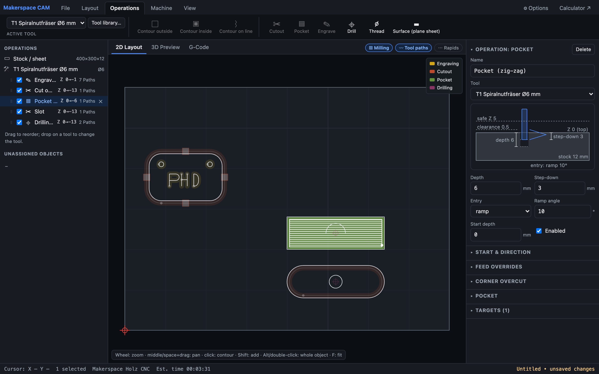
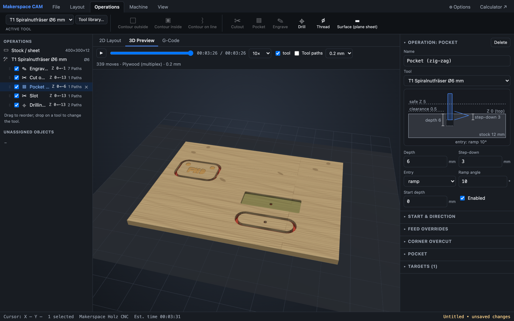
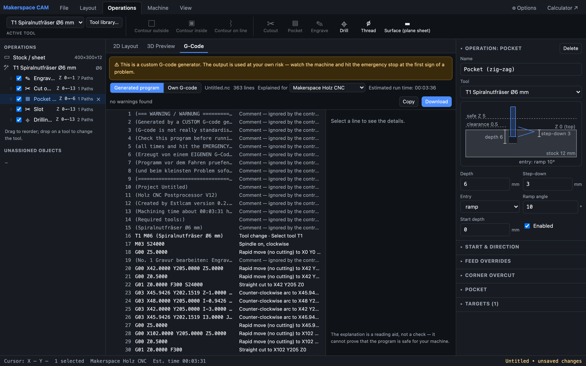
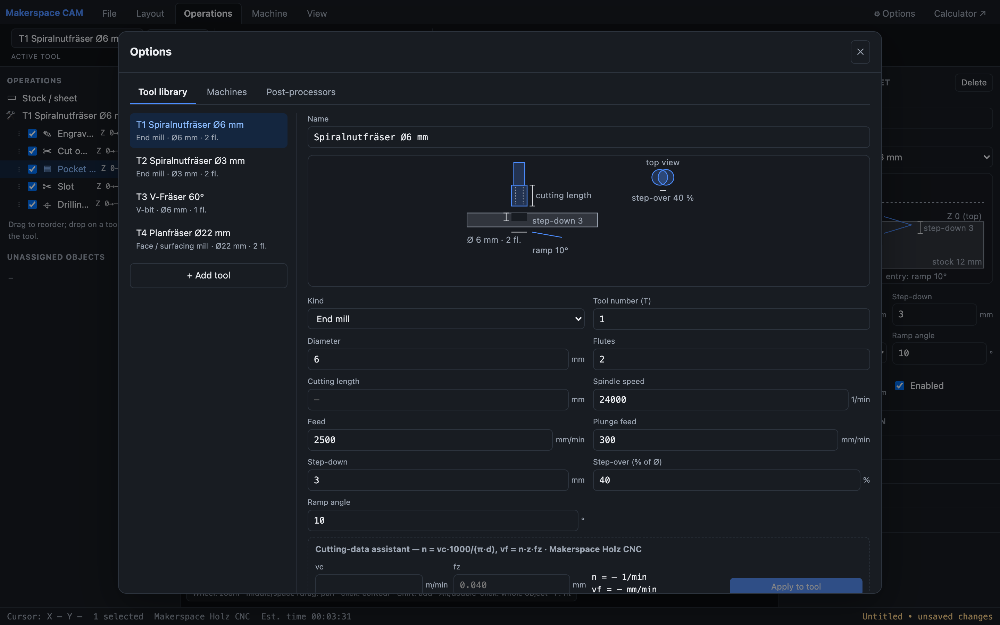

# Makerspace CAM/CAD (makerspace-camcad)

Browser-based 2.5D CAM for the Makerspace machines: import DXF/SVG outlines, lay them out on a sheet, assign
operations (contour, cutout with bridges, pocket, engraving, drilling), preview toolpaths and generate G-code through
data-driven post-processor profiles. The G-code view explains every line for the selected machine (movement, distance,
feed, duration, limit violations) and also explains G-code you paste in yourself. Fully static
(Next.js `output: 'export'`), no server. The original cutting-data
calculator lives on at `/calc/` and is embedded in the tool editor.

## Screenshots

**2D layout** – imported DXF/SVG outlines on the sheet, operations in execution order in the tree, the milled area (Fräsbild)
and tool paths as layers, and the selected operation's parameters with a live diagram on the right.



**3D preview** – material simulation on a heightmap: plywood layers on the cut walls, pockets and engravings tinted by
operation, through-cuts shown as blue floors and over-cuts in red, with tool animation and playback.



**G-code** – the generated program with a plain-language explanation for every line, warnings, and download for the
selected machine's post-processor.



**Tool library** – tools with a diagram of their parameters (diameter, flutes, cutting length, step-down, step-over, ramp
angle) and the embedded cutting-data assistant.



## ⚠ Safety

This is a **custom G-code generator** — you use the generated programs **at your own risk**. G-code is not really
standardised and no software is bug free; parts of the output have been checked, but correctness for your machine and
your job cannot be guaranteed. Always review the program (and the 2D/3D preview) before running it, keep the machine
in view the whole time and hit the **emergency stop** (not the pause) as soon as anything looks wrong. The same
disclaimer is shown before every export and written into the header of every generated file.

## Run

```bash
npm install
npm run dev        # development
npm run build      # static export to out/
npm start          # serve out/
npm test           # vitest (geometry, CAM, post-processor)
npm run screenshots  # re-render docs/screenshots/ from out/ with the local Chrome (needs npm run build first)
```

## Deployment

Every push to `main` builds the static export and publishes it to GitHub Pages via
`.github/workflows/deploy.yml`. A project Pages site is served from a subpath, so the workflow sets
`NEXT_PUBLIC_BASE_PATH=/<repo>` before building; leaving that variable unset builds for the root path,
which is what local development uses.

## Layout

```
app/            page.tsx (CAM), calc/page.tsx (calculator)
components/     shell (ribbon, tree, status, G-code view), canvas2d, panels, modals, ui, calc
lib/model       project document model (shapes, placements, groups, stock, tools, machines, operations)
lib/geometry    paths with arcs, transforms, arc refit, offsetting (clipper-lib), containment
lib/import      DXF (dxf-parser), SVG (DOMParser), joining/orientation
lib/cam         planner: depth passes, ramp/helix entries, contour/cutout/tabs/pocket/drill, zero point, time estimate
lib/post        Estlcam-compatible post-processor emitter, .pp import/export, built-in profiles
lib/store       zustand stores (project with undo/redo, UI, machine/tool/profile library), actions
lib/persist     File System Access API with download fallback
public/samples  example drawings
tests/          unit tests and the Estlcam golden files (holzcncv12.pp, namensschild.nc)
```

## Post-processors

Profiles mirror Estlcam's `.pp` format (word order, repeat flags, arcs on/off, I/J relative, header/footer/tool change
blocks) and can be imported from `.pp` files in *Options → Post-processors*. Built-ins: Makerspace Holz CNC (Estlcam V12),
generic GRBL mill, generic GRBL laser, IMA BIMA placeholder (the IMA is programmed via IMAWOP FMC files; exporter pending).

## Status

Done: shell (ribbon, tree with tool blocks in execution order and drag-and-drop, 2D canvas with Fräsbild / tool path /
rapid layers, collapsible parameter panel with live diagrams, G-code view), DXF/SVG import with contour-level selection,
placement (move/rotate/mirror/array/group), contour outside/inside/on/left/right, cutout with automatic or manually placed
bridges, pocket with wall side + safe zone + exclusion zones, engraving, drilling, dog-bone/T-bone, start point/angle/depth,
per-machine climb permission, zero-point modes, undo/redo, project save/open (`.cncproj`), autosave, tool/machine/profile
library, 3D preview: heightmap material simulation in a Web Worker (`workers/cam.worker.ts`), procedural MDF/OSB/plywood/
wood/aluminium/acrylic looks (plywood layers on cut walls), 0.1 mm grid over the machined region, blue through-cut floors,
red over-cuts, cut areas coloured by operation, animated tool with material following it, playback; text objects from
bundled OFL fonts (`public/fonts/`) or uploaded TTF/OTF, created together with tool and operation (stroke-width check);
thread milling; point snapping (`lib/geometry/snap.ts`) for drill/thread points and bridges: segment ends and centres,
⅓ ⅔ ¼ ¾ points, arc and contour centres, plus a reference line between two dwelled-on points with its own fraction
points; pockets link rings at depth with one ramp per pass.

Pending: laser operations end-to-end + SVG export, saw blades, IMA FMC exporter, IndexedDB project cache.
